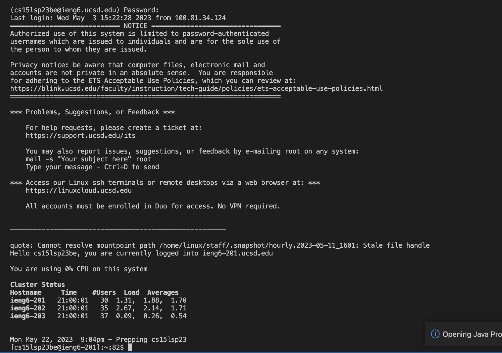
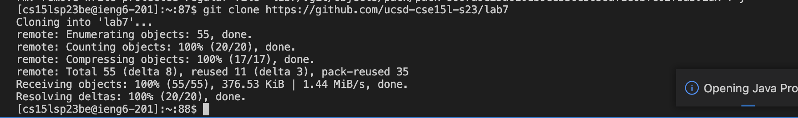
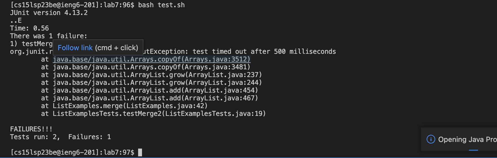
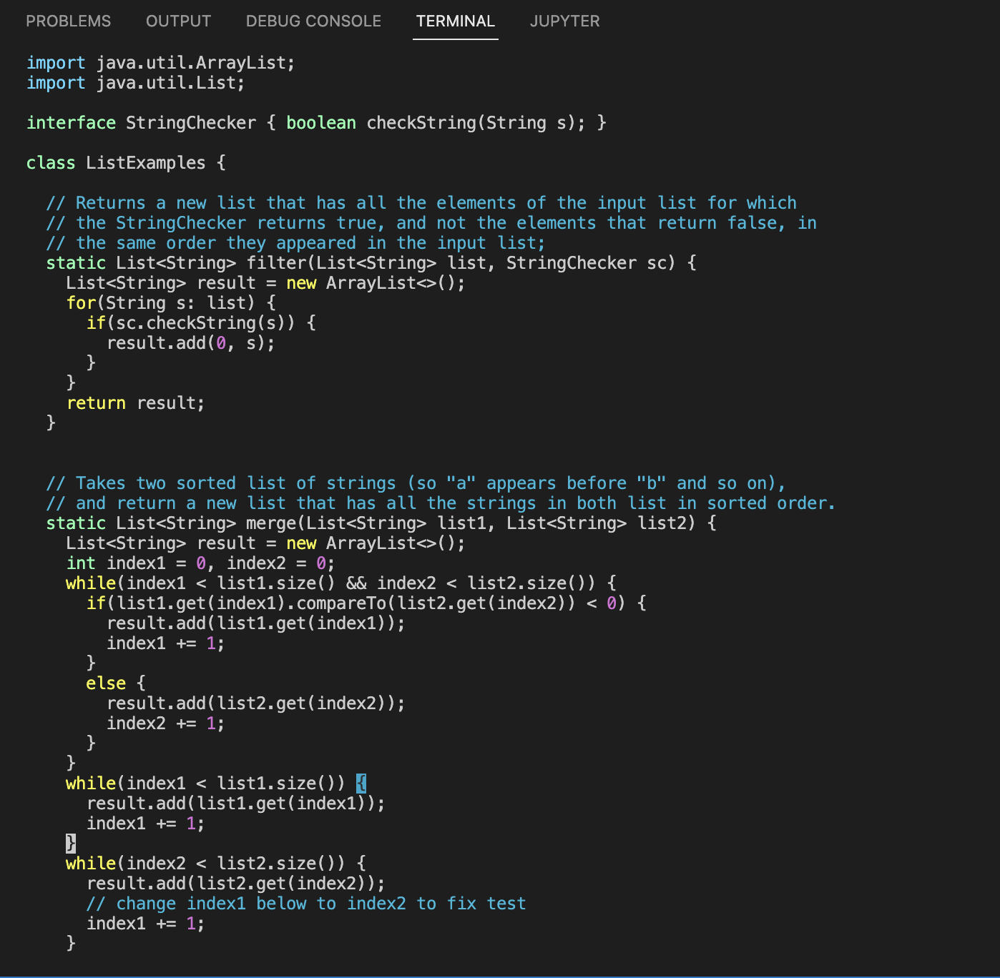

***Step 4:***

The first step is to log into your ieng6 account through a bash terminal. This uses the following command: ```ssh cs15lsp23zz@ieng6.ucsd.edu``` where zz is replaced by the specific letters in your account. The button ```<enter>``` is pressed after this. This will start the command which will then prompt you to enter your password. Keypresses here will differ depending on your password. Once again the button ```<enter>``` is pressed in order to enter the password of your account. This will then complete the login process. 


***Step 5:***

The next step is to clone the repository that you had previously forked. This uses the following command : ```git clone https://github.com/ucsd-cse15l-s23/lab7```. The button ```<enter>``` is pressed after this. This will start the command which will then clone the fork of the repository from your Github account. 


**Step 6:***

The next step is to run the tests in ListExamplesTests.java. To do this, we run the bash script called ```test.sh```. This can be done by running the following command: ```bash test.sh```. The button ```<enter>``` is pressed after this. This command will run the bash script which already has javac commands ready for the tests. As can be seen through the image, one of the tests had failed, let's try to fix it!


***Step 7:***


The next step is to try to fix the problem in the code. To do this, we run the command ```vim ListExamples.java```. The button ```<enter>``` is pressed after this. This command will open the code in vim for us to edit. To fix the code, we must change the 43rd line. Instead of pressing ```<j>``` to go down to that line, we type ```<4> <3> <j>```. Now instead of pressing ```<l>``` multiple times to change the line from ```index1 += 1;``` to ```index2 += 1;```, we type ```<1> <2> <l>```. After this, we enter insert mode by pressing ```<i>```. Then we press ```<backspace>```, and ```<2>```. Then we press ```<esc>```. To save your changes, type the following: ```<:> <w> <q> <enter>```. All of this will fix the mistake in ListExamples.java and save the changes made. 
