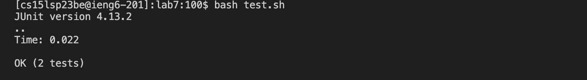
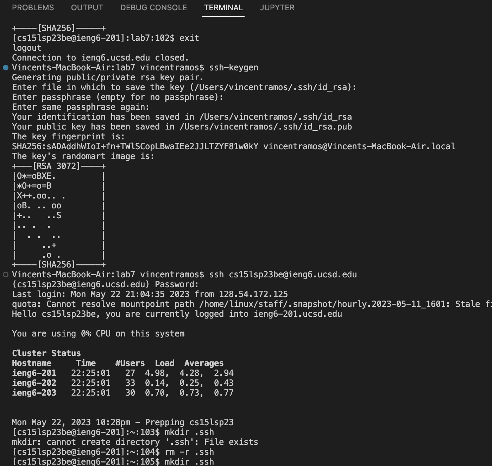
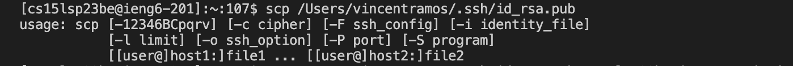
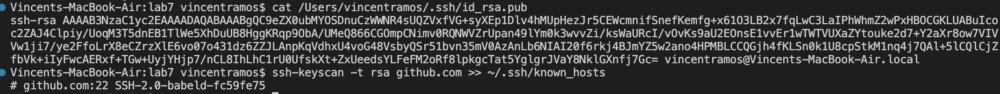
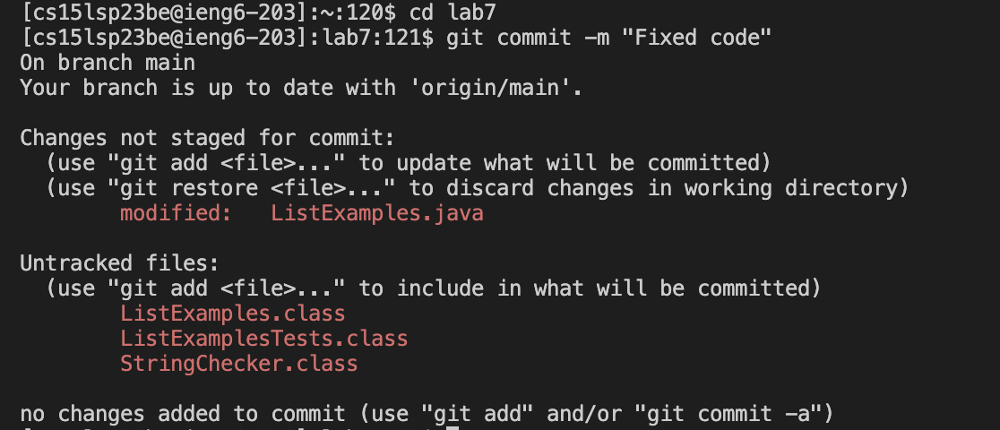

***Step 1:***

The first step is to log into your ieng6 account through a bash terminal. This uses the following command: ```ssh cs15lsp23zz@ieng6.ucsd.edu``` where zz is replaced by the specific letters in your account. The button ```<enter>``` is pressed after this. This will start the command which will then prompt you to enter your password. Keypresses here will differ depending on your password. Once again the button ```<enter>``` is pressed in order to enter the password of your account. This will then complete the login process. 


***Step 2:***

The next step is to clone the repository that you had previously forked. This uses the following command : ```git clone https://github.com/ucsd-cse15l-s23/lab7```. The button ```<enter>``` is pressed after this. This will start the command which will then clone the fork of the repository from your Github account. 


**Step 3:***

The next step is to run the tests in ListExamplesTests.java. To do this, we run the bash script called ```test.sh```. This can be done by running the following command: ```bash test.sh```. The button ```<enter>``` is pressed after this. This command will run the bash script which already has javac commands ready for the tests. As can be seen through the image, one of the tests had failed, let's try to fix it!


***Step 4:***


The next step is to try to fix the problem in the code. To do this, we run the command ```vim ListExamples.java```. The button ```<enter>``` is pressed after this. This command will open the code in vim for us to edit. To fix the code, we must change the 43rd line. Instead of pressing ```<j>``` to go down to that line, we type ```<4> <3> <j>```. Now instead of pressing ```<l>``` multiple times to change the line from ```index1 += 1;``` to ```index2 += 1;```, we type ```<1> <2> <l>```. After this, we enter insert mode by pressing ```<i>```. Then we press ```<backspace>```, and ```<2>```. Then we press ```<esc>```. To save your changes, type the following: ```<:> <w> <q> <enter>```. All of this will fix the mistake in ListExamples.java and save the changes made. 


***Step 5:***

The next step is to run the tests again to see that they now work. Once again, we will run the command ```bash test.sh```, and press ```<enter>``` after. The image above shows the output of the command, which means that our newly fixed code functions correctly!.


***Step 6:***




The last step is to commit and push the resulting change to your Github account. First, we must generate an ssh key. To do this, exit your ieng6 account with the command ```exit``` and pressing ```<enter>``` and type the following command: ```ssh-keygen``` and press the following keys: ```<enter> <enter> <enter> <enter>```. This will generate a public key for your use. Then once again log into your account by repeating ***Step 1***. Type the command: ```mkdir .ssh``` and press ```<enter>```. This will make the directory the .ssh file which was created when getting a public key. Log out of your ieng6 account again with the command ```exit``` and pressing ```<enter>```. 


***Optional***
Scroll up with either your mouse or ```<up>``` until you can see the text "Your public key has been saved in: ...". Use this path in the following command: ```scp <path to your public SSH key>``` and press ```<enter>```. Once more, it will ask for your password, type it and press ```<enter>```. Try to log into your account again using ***Step 1***, and it shouldn't ask for your password this time. Follow these steps:


***Required***
Display the SSH public key generated above to your clipboard using cat like below; you can copy it by highlighting and right-clicking
cat <path of your ssh key .pub file> and pressing ```<enter>``` (Make sure you are logged out for this)
  
  
Open your Github account on the browser.
  
  
In the upper right corner, click on your profile photo, then click Settings.
  
  
In the “Access” section of the sidebar, click SSH and GPG keys.
  
  
Click New SSH key or Add SSH key under the “SSH keys” section.
  
  
Add a “Title” to your key (ex: Your Name’s ieng6 machine).
  
  
Select the “Key Type” to be an Authentication Key
  
  
Copy your public key from the output of the cat command and paste it into the “Key” field ```<ctrl> + <c> <ctrl> + <v>```
  
  
Click Add SSH key.
  
  
If prompted, confirm access to your account on Github.
  
  
Now, run the following command: ```ssh-keyscan -t rsa github.com >> ~/.ssh/known_hosts``` and press ```<enter>```. Check your connection with the command: ```ssh -T git@github.com```. You should receive a response somewhere along the lines “Hi supercoolstudent1234! You’ve successfully authenticated, but GitHub does not provide shell access.”
  
Once more, we can log into our accounts and begin the process of committing and pushing the changes. To commit your changes, use the command ```git commit -m "Message of what you changed``` and press ```<enter>```. Take your ssh key from the code button next to the add file button and use the command ```git push <ssh key>```. THis will finally push the changes to your Github account, completing the final step of this process!. 
